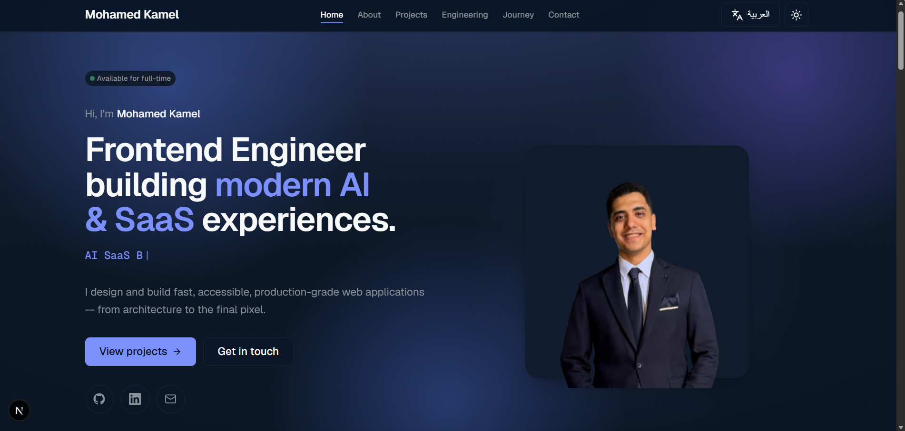

<div align="center">

# MohamedKamel.dev

**A premium, production-grade engineering portfolio — bilingual, accessible, and server-first.**

Built with the Next.js App Router and React Server Components, documented like a product, and engineered to the quality bar of a modern SaaS release.

[](https://nextjs.org/)
[](https://react.dev/)
[](https://www.typescriptlang.org/)
[](https://tailwindcss.com/)
[](#-license)

[Live](#-live-website) · [Features](#-features) · [Tech Stack](#-tech-stack) · [Architecture](#-architecture) · [Documentation](#-documentation)

</div>

---

## Overview

**MohamedKamel.dev** is the personal engineering portfolio of Mohamed Kamel Atlam — a frontend engineer who thinks in systems. It's not a template: every page is a Server Component by default, every design value resolves to a token, and every architectural decision is written down before the code. The site ships in **English and Arabic** (full RTL), in **dark and light** themes, and is statically generated for the best possible performance.

> [!NOTE]
> The documentation is part of the product. It is the single source of truth — start at **[`docs/README.md`](./docs/README.md)** and the keystone **[`docs/engineering/ARCHITECTURE.md`](./docs/engineering/ARCHITECTURE.md)**.

---

## Hero image

<!--
  Add a screenshot of the landing page here.
  Suggested: save it to `docs/assets/hero.png` (create the folder), then
  uncomment the line below. A wide (≈1600×900) dark-theme capture reads best.
-->



---

## 🌐 Live Website

> 🔗 **Placeholder** — production URL:

**[mohamedkamel.dev](https://mk-portfolio-f23d.vercel.app)**

---

## ✨ Features

### User Experience

- 🌗 **Dark / Light / System theme** — resolved pre-paint, so there's never a flash of the wrong theme
- 🌍 **English / Arabic** — full right-to-left support via logical properties, not mirrored hacks
- 📱 **Fully responsive** — designed mobile-first, refined for tablet and desktop
- 🎬 **Premium motion** — a token-driven, reduced-motion-aware system (scroll reveals, page transitions, route progress, first-visit splash)
- ♿ **Accessible by default** — WCAG AA, keyboard-navigable, screen-reader friendly

### Engineering

- ⚡ **Next.js App Router** with **React Server Components** (server-first)
- 🧱 **Static Generation (SSG)** — every route is prerendered and edge-cacheable
- 🧩 **TypeScript** in `strict` mode (`noUncheckedIndexedAccess`, `noImplicitOverride`)
- 🎨 **Tailwind CSS** driven entirely by **design tokens** — no hardcoded values
- 🏛 **Feature-based architecture** — clear layers, inward-only dependencies
- 🔍 **SEO** — Metadata API, canonical + `hreflang`, sitemap, robots
- 🧠 **Structured data** — Person, WebSite, BreadcrumbList, CreativeWork, TechArticle (JSON-LD)
- 🚀 **Performance** — minimal client JavaScript, image + font optimization, security headers

### Content

| Section         | What it is                                                                                       |
| --------------- | ------------------------------------------------------------------------------------------------ |
| **Projects**    | Engineering case studies with a reading experience (progress bar, sticky TOC, chapter numbering) |
| **Engineering** | A living-documentation hub with deep-dive articles and an ADR log                                |
| **Journey**     | The year-by-year story of growing from AI student to systems-minded engineer                     |
| **Contact**     | A validated message form (Server Action) plus direct channels including WhatsApp                 |

All content is schema-validated **MDX** — content as data, not hardcoded markup.

---

## 🧰 Tech Stack

| Category       | Technology                                                                                                |
| -------------- | --------------------------------------------------------------------------------------------------------- |
| **Framework**  | [Next.js 15](https://nextjs.org/) — App Router, RSC, Metadata API                                         |
| **Language**   | [TypeScript 5](https://www.typescriptlang.org/) (strict)                                                  |
| **UI runtime** | [React 19](https://react.dev/) — Server Components by default                                             |
| **Styling**    | [Tailwind CSS 3](https://tailwindcss.com/) + design tokens (CSS custom properties)                        |
| **Animations** | Custom, dependency-free motion system (CSS keyframes + Intersection Observer)                             |
| **Icons**      | [Lucide](https://lucide.dev/) (monochrome, tree-shaken)                                                   |
| **Fonts**      | [Geist](https://vercel.com/font) Sans & Mono via `next/font`                                              |
| **Content**    | [MDX](https://mdxjs.com/) (`next-mdx-remote`) + [Zod](https://zod.dev/) schema validation + `gray-matter` |
| **SEO**        | Next Metadata API + JSON-LD structured data                                                               |
| **Deployment** | [Vercel](https://vercel.com/)                                                                             |
| **Quality**    | ESLint · Prettier · Husky · lint-staged · `tsc --noEmit`                                                  |

---

## 🏗 Architecture

The codebase follows a **four-layer, feature-based architecture** (see [`ARCHITECTURE.md`](./docs/engineering/ARCHITECTURE.md) and [ADR-0002](./docs/adr/ADR-0002-Feature-Architecture.md)):

- **Routing layer** (`src/app`) — thin App Router segments that resolve the locale and compose a feature's sections.
- **Feature layer** (`src/features`) — self-contained domains (`home`, `about`, `projects`, `engineering`, `journey`, `contact`). Features never import another feature's internals.
- **Shared layer** (`src/shared`) — the design system, primitives, config, i18n, providers, and utilities every feature builds on.
- **Content layer** (`src/content`) — schema-validated MDX collections consumed as typed data.

**Guiding principles**

- **Server-first** — components are Server Components unless interactivity genuinely requires the client; client islands are pushed to the leaves ([ADR-0006](./docs/adr/ADR-0006-Rendering-Strategy.md)).
- **Minimal Client Components** — a small, deliberate set (theme, navigation, forms, scroll/pointer effects). Everything else ships as zero-JS HTML.
- **State hierarchy** — **server state → URL state → local state**; there is no global client store (see [`STATE_MANAGEMENT.md`](./docs/engineering/STATE_MANAGEMENT.md)).
- **Tokens over hardcoding** — every color, space, type, and motion value resolves to a design token, enforceable in CI ([ADR-0003](./docs/adr/ADR-0003-Tailwind.md)).

---

## 📁 Project Structure

<details>
<summary><strong>Folder tree</strong> (click to expand)</summary>

```text
mk-portfolio/
├─ src/
│  ├─ app/                    # Routing layer — App Router
│  │  └─ [locale]/            # Localized routes (home, about, projects, engineering, journey, contact)
│  │     ├─ layout.tsx        # Document shell: <html lang/dir>, fonts, providers, header/footer
│  │     ├─ template.tsx      # Per-navigation page transition
│  │     ├─ error.tsx         # Localized error boundary
│  │     └─ loading.tsx       # Suspense fallback
│  ├─ features/               # Feature layer — self-contained domains
│  │  ├─ home/  about/  projects/  engineering/  journey/  contact/
│  │  └─ <feature>/           # components · lib · content (structural atoms)
│  ├─ shared/                 # Shared layer — the design system & cross-cutting code
│  │  ├─ ui/                  # Primitives (Button, Card, Section, Heading, motion, background…)
│  │  ├─ lib/                 # Utilities (cn, seo, structured-data, toc, tech-icons…)
│  │  ├─ config/              # Site, fonts, social config
│  │  ├─ i18n/                # Locale config, dictionaries (en/ar), get-dictionary
│  │  ├─ providers/           # Theme + app-wide client providers
│  │  ├─ assets/  constants/  hooks/  styles/  types/
│  ├─ content/                # Content layer — schema-validated MDX
│  │  ├─ projects/  engineering/  journey/  experience/
│  │  ├─ schema.ts            # Zod schemas (one source for validation + types)
│  │  └─ mdx.tsx              # MDX render pipeline (rehype/remark)
│  └─ middleware.ts           # Locale detection & routing
├─ docs/                      # The documentation product (product · design · engineering · adr)
├─ public/                    # Static assets (images, icons)
└─ next.config.mjs            # Image optimization + security headers
```

</details>

| Folder         | Responsibility                                                             |
| -------------- | -------------------------------------------------------------------------- |
| `src/app`      | Routing-layer segments, layouts, and metadata routes                       |
| `src/features` | The six product features, each owning its own components and content atoms |
| `src/shared`   | Design system, primitives, config, i18n, providers, utilities              |
| `src/content`  | MDX collections (projects · engineering · journey · experience)            |
| `docs`         | Product, design, engineering, and ADR documentation                        |

---

## ⚡ Performance

Built to meet **Lighthouse ≥ 95 performance** and **100 accessibility / best-practices / SEO**, with **Core Web Vitals** (LCP, CLS, INP) treated as budgets, not afterthoughts.

- **Server Components** keep client JavaScript minimal (~102 kB shared baseline)
- **Static Generation** — all routes prerendered and edge-cacheable
- **Image optimization** — AVIF/WebP via `next/image`, explicit dimensions (zero layout shift), long-lived cache
- **Font optimization** — `next/font` (Geist), no layout shift, no external requests
- **Code splitting** — client islands loaded only where interactivity lives

See [`PERFORMANCE.md`](./docs/engineering/PERFORMANCE.md).

---

## 🔍 SEO

Everything runs through one metadata contract for consistency across locales (see [`SEO.md`](./docs/engineering/SEO.md)):

- **Metadata API** — per-route titles, descriptions, and Open Graph / Twitter cards
- **JSON-LD** — Person, WebSite, BreadcrumbList, CreativeWork, TechArticle
- **Canonical URLs** + **`hreflang`** alternates (including `x-default`)
- **Per-locale Open Graph / Twitter images** (generated at the edge)
- **`robots.txt`** and **`sitemap.xml`** generated from the content layer
- **Web app manifest** and theme-color metadata

---

## ♿ Accessibility

WCAG **AA** is the baseline, not the goal (see [`ACCESSIBILITY.md`](./docs/engineering/ACCESSIBILITY.md)):

- **Semantic HTML** and correct **landmark** usage (`header` / `main` / `nav` / `footer`)
- **Heading hierarchy** — a single `<h1>` per route, no skipped levels
- **Keyboard navigation** with a visible, token-driven **focus ring**
- **Reduced motion** — every animation has a calm `prefers-reduced-motion` fallback
- **Color contrast** verified AA in both themes
- **ARIA** used precisely, only where semantics can't carry the meaning

---

## 🎨 Design

A dark-first design system expressed entirely through tokens (see [`DESIGN_SYSTEM.md`](./docs/design/DESIGN_SYSTEM.md)):

- **Design tokens** — color, spacing (8-pt), radius, shadow, z-index, motion — projected into Tailwind ([`DESIGN_TOKENS.md`](./docs/design/DESIGN_TOKENS.md))
- **Color system** — semantic tokens backed by CSS custom properties, dark & light ([`COLOR_SYSTEM.md`](./docs/design/COLOR_SYSTEM.md))
- **Typography** — a fluid, restrained scale on Geist ([`TYPOGRAPHY.md`](./docs/design/TYPOGRAPHY.md))
- **Motion** — purposeful, fast, token-timed; never decorative ([`MOTION_GUIDELINES.md`](./docs/design/MOTION_GUIDELINES.md))

---

## 🚀 Getting Started

**Prerequisites:** Node.js **≥ 20.11** and npm.

```bash
# 1. Clone
git clone https://github.com/mohamed-kamel-atlam/mk-portfolio.git
cd mk-portfolio

# 2. Install
npm install

# 3. Run the dev server → http://localhost:3000
npm run dev

# 4. Production build & serve
npm run build
npm run start
```

**Environment variables** (optional — sensible defaults apply):

| Variable               | Purpose                                                                  |
| ---------------------- | ------------------------------------------------------------------------ |
| `NEXT_PUBLIC_SITE_URL` | Canonical origin for metadata & sitemap (defaults to the production URL) |
| `CONTACT_WEBHOOK_URL`  | HTTPS endpoint the contact form posts to (no-op if unset)                |

**Scripts**

| Script              | Purpose                                           |
| ------------------- | ------------------------------------------------- |
| `npm run dev`       | Start the dev server                              |
| `npm run build`     | Production build                                  |
| `npm run start`     | Serve the production build                        |
| `npm run lint`      | ESLint (Next core-web-vitals + TypeScript + a11y) |
| `npm run typecheck` | `tsc --noEmit`                                    |
| `npm run format`    | Prettier write                                    |

---

## 📚 Documentation

The `docs/` folder is a first-class part of the project — the decision is written before the code. Start with the [documentation index](./docs/README.md).

<details>
<summary><strong>Key documents</strong> (click to expand)</summary>

**Product** — [Project Vision](./docs/product/PROJECT_VISION.md) · [Product Requirements](./docs/product/PRODUCT_REQUIREMENTS.md) · [Brand](./docs/product/BRAND.md) · [Roadmap](./docs/product/ROADMAP.md) · [Success Metrics](./docs/product/SUCCESS_METRICS.md)

**Design** — [Design System](./docs/design/DESIGN_SYSTEM.md) · [Design Language](./docs/design/DESIGN_LANGUAGE.md) · [Design Principles](./docs/design/DESIGN_PRINCIPLES.md) · [Design Tokens](./docs/design/DESIGN_TOKENS.md) · [Color System](./docs/design/COLOR_SYSTEM.md) · [Typography](./docs/design/TYPOGRAPHY.md) · [Motion Guidelines](./docs/design/MOTION_GUIDELINES.md) · [Component Philosophy](./docs/design/COMPONENT_PHILOSOPHY.md)

**Engineering** — [Architecture](./docs/engineering/ARCHITECTURE.md) · [Rendering Strategy](./docs/engineering/RENDERING_STRATEGY.md) · [Performance](./docs/engineering/PERFORMANCE.md) · [SEO](./docs/engineering/SEO.md) · [Accessibility](./docs/engineering/ACCESSIBILITY.md) · [Internationalization](./docs/engineering/INTERNATIONALIZATION.md) · [State Management](./docs/engineering/STATE_MANAGEMENT.md) · [Data Fetching](./docs/engineering/DATA_FETCHING.md) · [Folder Structure](./docs/engineering/FOLDER_STRUCTURE.md) · [AI Workflow](./docs/engineering/AI_WORKFLOW.md) · [CLAUDE.md](./docs/engineering/CLAUDE.md)

**Developer** — [Coding Standards](./docs/developer/CODING_STANDARDS.md) · [Component Catalog](./docs/developer/COMPONENT_CATALOG.md) · [Content Model](./docs/developer/CONTENT_MODEL.md) · [MDX Pipeline](./docs/developer/MDX_PIPELINE.md)

**Decisions (ADR)** — [App Router](./docs/adr/ADR-0001-App-Router.md) · [Feature Architecture](./docs/adr/ADR-0002-Feature-Architecture.md) · [Tailwind + Tokens](./docs/adr/ADR-0003-Tailwind.md) · [Internationalization](./docs/adr/ADR-0004-Internationalization.md) · [Theme System](./docs/adr/ADR-0005-Theme-System.md) · [Rendering Strategy](./docs/adr/ADR-0006-Rendering-Strategy.md)

</details>

---

## 🤖 AI Workflow

This project is built with **AI-assisted engineering**, deliberately and with a human owning every decision (see [`AI_WORKFLOW.md`](./docs/engineering/AI_WORKFLOW.md)):

- **Tools** — Claude (Claude Code), ChatGPT, and GitHub Copilot accelerate the mechanical work.
- **Documentation-first** — the governing decision is written before implementation, so the AI and the engineer work from the same intent.
- **Human-in-the-loop** — AI proposes; the engineer decides the architecture, owns the trade-offs, and reviews every line.
- **Verified** — nothing ships unread; every change passes `lint`, `typecheck`, and `build`.

> AI improves productivity — it does not replace engineering judgment.

---

## 🗺 Roadmap

**✅ MVP (shipped)** — Landing · About · Projects · Engineering · Journey · Contact · English/Arabic · Dark/Light · SEO · Responsive

<details>
<summary><strong>Future</strong> (click to expand)</summary>

**Version 2 — enhancements on the shipped MVP**

- Command Menu (⌘K navigation, search, theme, language)
- Site-wide Search across projects, articles, and notes
- Blog (technical articles)
- Interactive Playground (streaming, Suspense, Server Actions demos)
- Public Performance Dashboard
- Analytics · Advanced Motion · Project Filters

**Version 3 — platform evolution**

- CMS · Admin Panel · AI Assistant · Interactive Demos · Project Analytics

See [`ROADMAP.md`](./docs/product/ROADMAP.md) for the full delivery plan.

</details>

---

## 👤 Author

**Mohamed Kamel Atlam** — Frontend Engineer

- 🌐 Portfolio — [mohamedkamel.dev](https://mohamedkamel.dev)
- 💼 LinkedIn — [mohamed-atlam](https://www.linkedin.com/in/mohamed-atlam-597496290)
- 🐙 GitHub — [mohamed-kamel-atlam](https://github.com/mohamed-kamel-atlam)
- ✉️ Email — [mohamedatlam1710@gmail.com](mailto:mohamedatlam1710@gmail.com)

---

## 📄 License

**Proprietary — © Mohamed Kamel Atlam. All rights reserved.**

This repository is published for portfolio and reference purposes. It is not open-source licensed (`"license": "UNLICENSED"`); please don't reuse the code or content without permission.

---

<div align="center">

Built with care, documented like a product.

</div>
